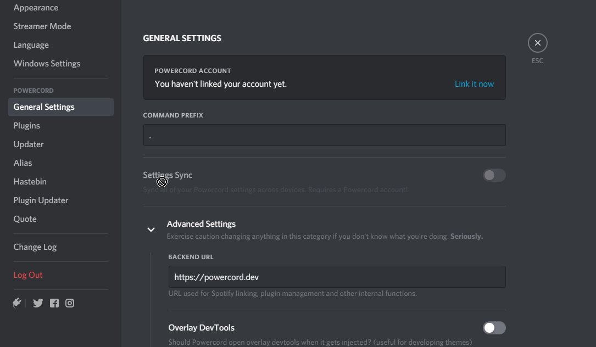

# Alias Plugin
This is a plugin made for [Powercord](https://github.com/powercord-org/powercord).

It allows you to "bind" text to custom commands, which you then use to send the text as a message (does not trigger commands).  
See the example gif below for details:

## Example

## Installation
1. Download with `git clone https://github.com/WD200019/alias pc-alias`
2. Move `pc-alias` to `Powercord/src/plugins/` and restart
